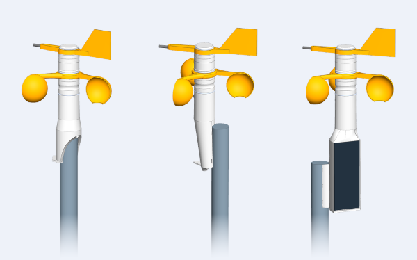
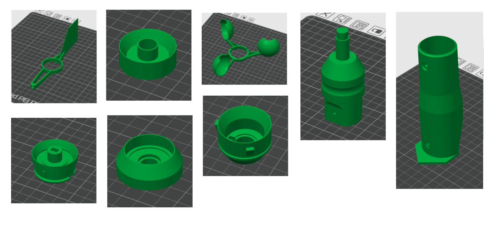

# 3D files for the WindNerd 3D-printed anemometer

The WindNerd anemometer is purpose-built for 3D printing and real-world use.
This repository includes the complete set of STL files for printing your own wind meter, along with the original **FreeCAD source files** you can edit to suit your needs.

### Features

- Easy to print in **PETG**, no supports required
- Maintainable: the most exposed parts are easily replaceable
- Bearings and other [essential hardware parts](doc/BILL_OF_MATERIALS.md#small-parts) are standard, off-the-shelf parts
- No wiring or mechanical contacts, sensing is **fully magnetic** using Hall ICs on a single integrated PCB
- Can house a Wi-Fi, cellular LTE or serial sensor board
- Modular: the anemometer head fits several receptacle variants, for different mounting options or extra features such as solar power

Electronics and essential parts are [**available as kits**](https://windnerd.net/en/shop) you can complete with your own 3D prints.

## STL - 3D printing
The STL files can be opened with a slicer like UltiMaker Cura or Bambu Studio.
Check out the [printing guide](https://windnerd.net/docs/anemometer/3d-printing).

## CAD (FCStd, FreeCAD)
The source files can be opened and edited with [FreeCAD](https://www.freecad.org/downloads.php), a free and open-source parametric CAD tool for Windows, Mac and Linux.

All files are openly licensed under [CC BY-SA 4.0](https://creativecommons.org/licenses/by-sa/4.0/)

© 2026 WindNerd.net – You are free to share and remix, even commercially, as long as you credit us and use the same license.