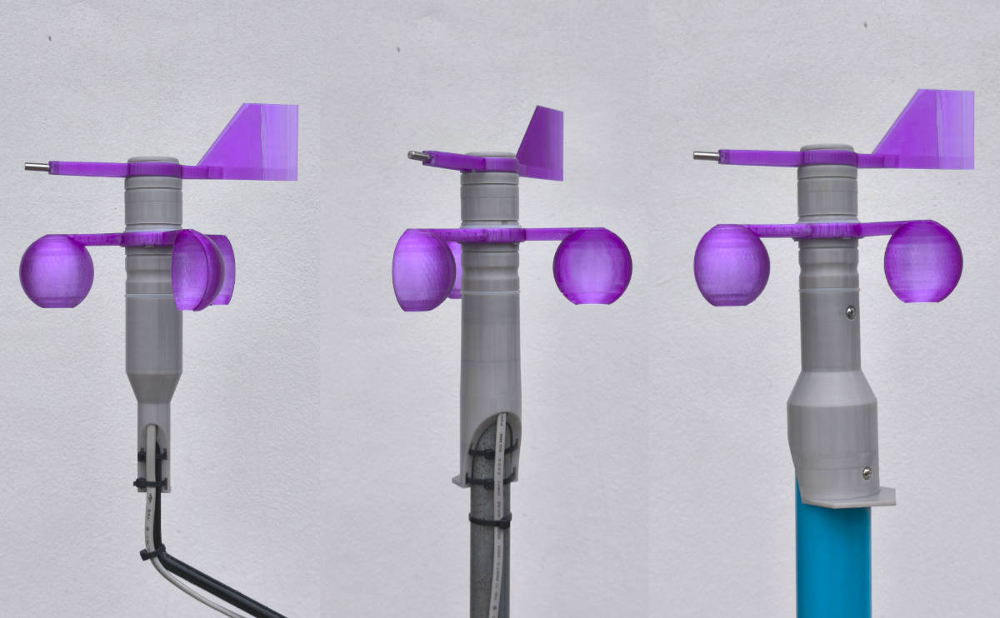
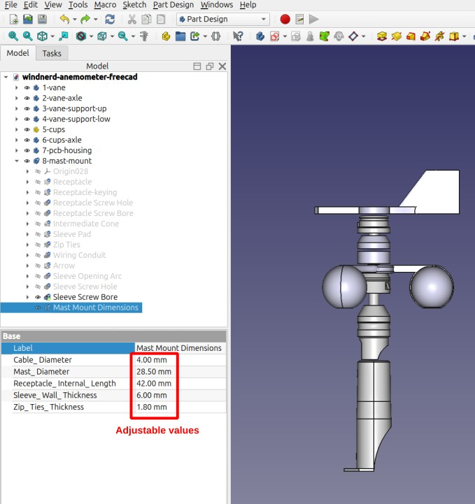

# Adjust dimensions for your mast

This repository includes ready-to-print mast-mount files that fit the most common steel tube and pipe diameters.

If none of the provided sizes match your requirement, you can easily generate a custom part by editing one variable in the CAD source file.

Follow these steps:

- Open **windnerd-anemometer-freecad.FCStd** in Freecad.
- Expand the **8-mast-mount** section.
- Select `Mast Mount Dimensions` variable set.
- Adjust the Mast_Diameter parameter as needed and verify the updated 3D preview.

- Select **8-mast-mount** section
- File -> Export -> save as STL mesh