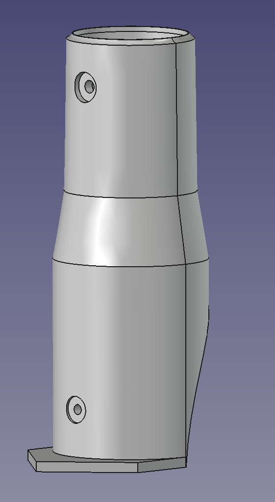
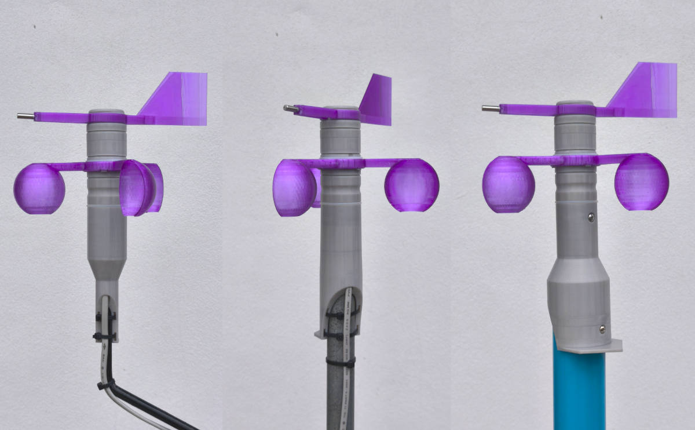
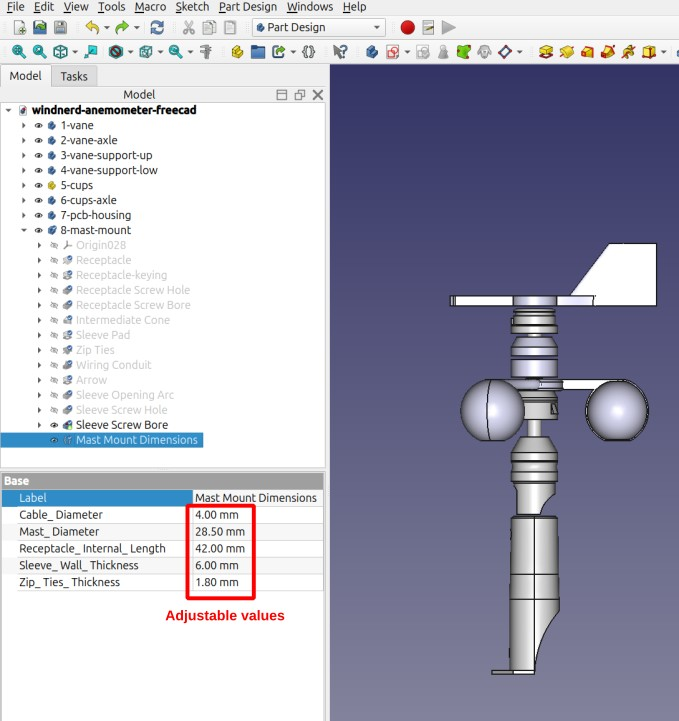

# 3D files for Top Mast Mount

## Adjust dimensions for your mast

This repository includes ready-to-print files that fit the most common steel tube and pipe diameters.

If none of the provided sizes match your requirement, you can easily generate a custom part by editing one variable in the CAD source file.

Follow these steps:

- Open **receptacles/top-mast-mount/top-mast-mount-variable-diameter.FCStd** in Freecad.
- Expand the **1-top-mast-mount** body.
- Select `Mast Mount Dimensions` variable set.
- Adjust the Mast_Diameter parameter as needed and verify the updated 3D preview.

- Select **1-top-mast-mount** body
- File -> Export -> save as STL mesh

All files are openly licensed via [CC BY-SA 4.0](https://creativecommons.org/licenses/by-sa/4.0/)

© 2026 WindNerd.net – You are free to share and remix, even commercially, as long as you credit us and use the same license.

